# Tutorial de Git y GitHub

Probablemente ya hayas utilizado ***GitHub*** por requisito de tu proyecto de Estadía, pero esta es una herramienta que va mucho más allá de eso❗. Aprender a dominar ***GitHub*** es un *must to* (tienes que) si estás pensando en entrar al mundo profesional de desarrollo en equipo de software 👨‍💻. Por eso traigo este intento de tutorial para que afiances más tus bases en ***GitHub***.

Con ***GitHub*** olvidense de estarse pasando las EPs por whats  o por gmail  y estar comprimiendo y descomprimiendo .zip's 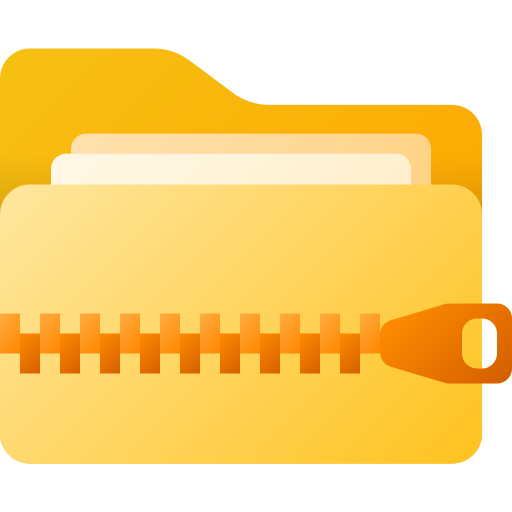 o estarse saboteando mientras todos editan el mismo replit  

>***GitHub*** es la manera más eficiente de trabajar en equipo (y por ello al inicio puede costar un poco, pero vale la pena).

## 1. Introducción
Para ver ***GitHub***, primero debemos entender qué es ***Git***.

###  Git

>***Git*** es una tecnología que permite guardar un registro de todas las versiones de tu proyecto de software a lo largo de su desarrollo. 

Es decir, con ***Git*** puedes ver cómo lucía tu código al iniciar tu proyecto, cómo lucía dos dias antes o cómo lucía antes de que alguien de tu equipo se le ocurriera meterle mano y provocar que ya ni compile, faltando un día para la entrega ⏱️❗. Con ***Git*** tienes todo el <u>historial de cómo ha ido evolucionando tu código</u> y puedes regresar a cualquiera de esas versiones como si de una máquina del tiempo se tratara 👨‍🔬.

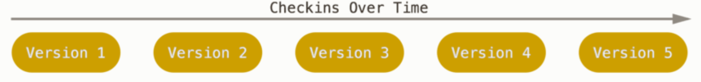

Pero no siempre es tan simple como una línea recta. Puede tener diferentes ramas, como si de universos paralelos se tratase 🌌. Pero eso lo vemos luego.

Mientras quedense con que ***Git*** es una herramienta que te permite tener un historial de las distintas versiones de tu proyecto y regresar a cualquier versión en cualquier momento.

###  GitHub

>***GitHub*** es una plataforma en línea que utiliza ***Git*** para almacenar y gestionar proyectos de manera <u>*colaborativa*</u>.

Es muy útil para trabajar en equipo, ya que permite a varios desarrolladores trabajar en un mismo proyecto al mismo tiempo de manera segura porque ***GitHub*** ofrece herramientas para revisar 🔍 y discutir 🗣️ los cambios realizados en el código 👨‍💻.

En resumen (que no se note el chat jaja), los beneficios de usar ***Git*** y ***GitHub*** incluyen:
- [x] Mantener un historial de cambios. 🔍
- [x] Facilitar la colaboración entre múltiples desarrolladores. 🤝
- [x] Permitir la recuperación de versiones anteriores del proyecto. ⏪

También es importante saber que ***Git*** y ***GitHub*** no son lo mismo:
- ***Git*** es de uso local (guarda el historial del proyecto en tu compu) 🏠.
- ***GitHub*** es de uso remoto (guarda el historial en la nube) 🌐.

## 2. Cómo usarlo ⁉️

Muy bonito y todo, pero ¿cómo se usa? Aquí les dejo una guía rápida de cómo pueden empezar a utilizar ***Git*** y ***GitHub*** 🏃.

Recuerden que con ***GitHub*** tendremos el <u>proyecto en internet</u> que todos los integrantes del equipo podrán ver y modificar. 

Con ***Git*** tendremos una <u>copia local</u> de ese proyecto en nuestra computadora para poder trabajar en él.

>Apartir de ahora en vez de decir *proyecto*, diremos *repositorio* y en lugar de copiar, diremos clonar.

### Instalar GitHub Desktop  

Por lo popular que es este *workflow* (flujo de trabajo) de ***Git*** y ***GitHub***, ya existen herramientas que facilitan su uso. Una de ellas es ***GitHub Desktop***, que es una interfaz gráfica para usar ***Git*** y ***GitHub***. Pueden descargarla [aquí](https://desktop.github.com/).

Al instalarla, les pedirá que inicien sesión con su cuenta de ***GitHub***. Si no tienen, les da la opción de crear una.

Como yo ya tengo una cuenta, le daré en Sign in to GitHub.com

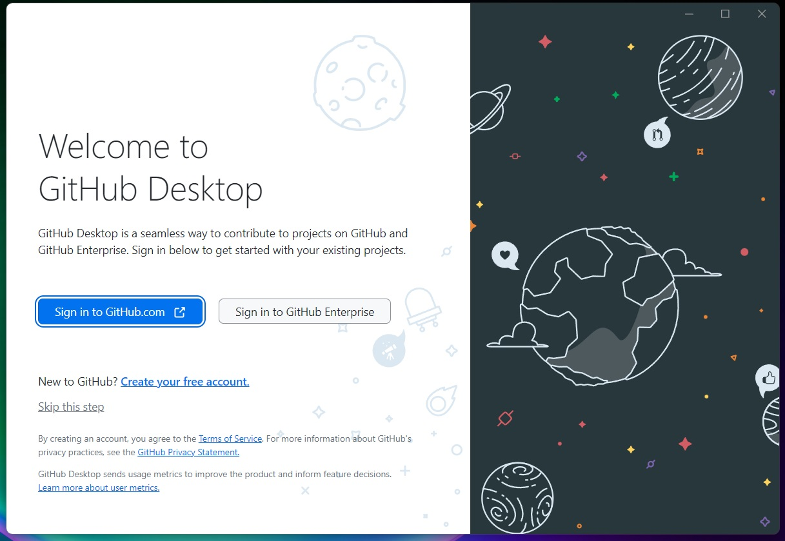

***Git*** requiere que le digas quién eres para que pueda registrar los cambios que hagas en el proyecto. Así que les pedirá poner su nombre y correo electrónico (Por defecto, usará el nombre y correo electrónico que tengan en su cuenta de ***GitHub***).

Y le dan en Finish

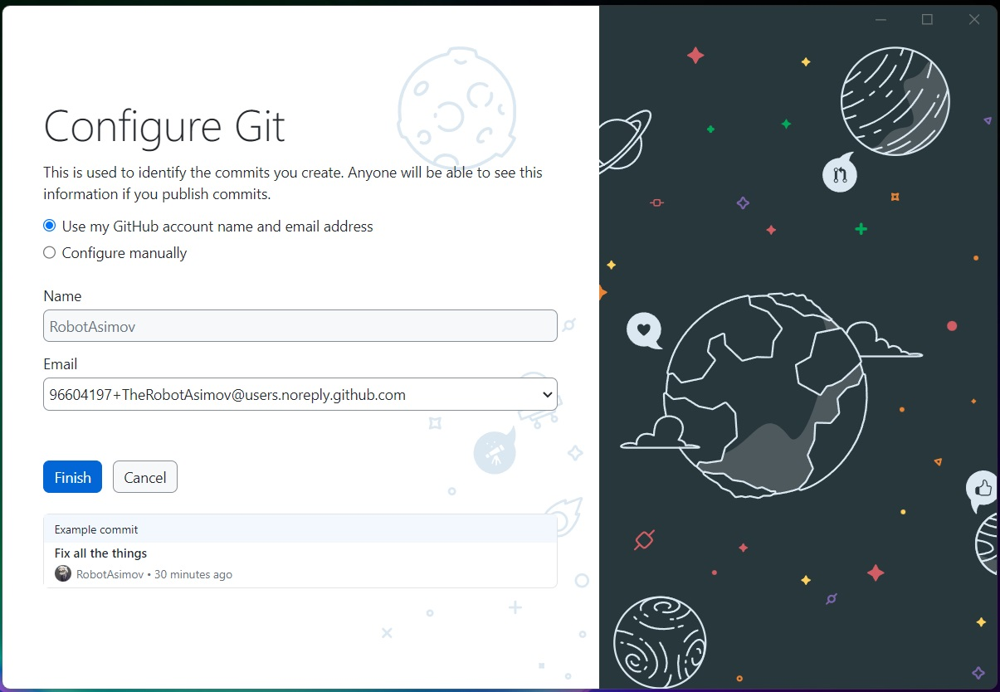

Después de eso, ya les aparecerá la pantalla principal de ***GitHub Desktop***.

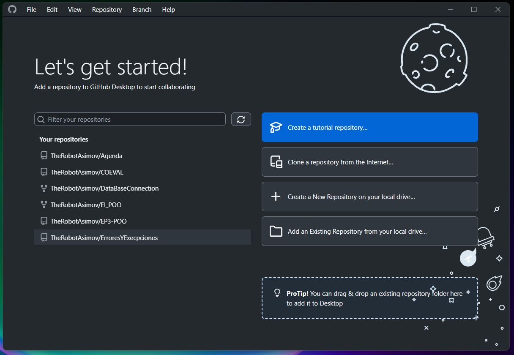

Te da 4 opciones:
- [x] Crear un repositorio local y subirlo a GitHub a modo de tutorial.
- [ ] Clonar un repositorio que ya exista en GitHub.
- [ ] Crear un repositorio local.
- [ ] Abrir un repositorio que ya exista en tu computadora.

Haremos el tutorial. Entonces seleccionamos Create a tutorial repository

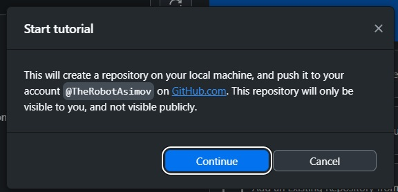

Les abrirá este mensaje. Prácticamente les dice lo que les vengo diciendo, que va a crear un repositorio en su computadora y que lo va a subir a ***GitHub***. Le dan en Continue

### Crear Repositorio

¿Qué creen? ya crearon su propio repositorio local 🙌 (lo pueden buscar en su compu en *Documentos/GitHub/desktop-tutorial*). 

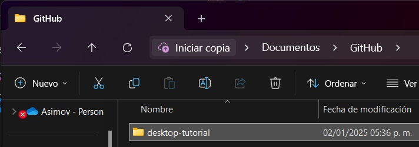

Ya hasta lo subieron a ***GitHub*** (todo automáticamente jaja). Si no me creen, vayan a su cuenta de ***GitHub*** y verán que ya tienen un repositorio llamado desktop-tutorial.

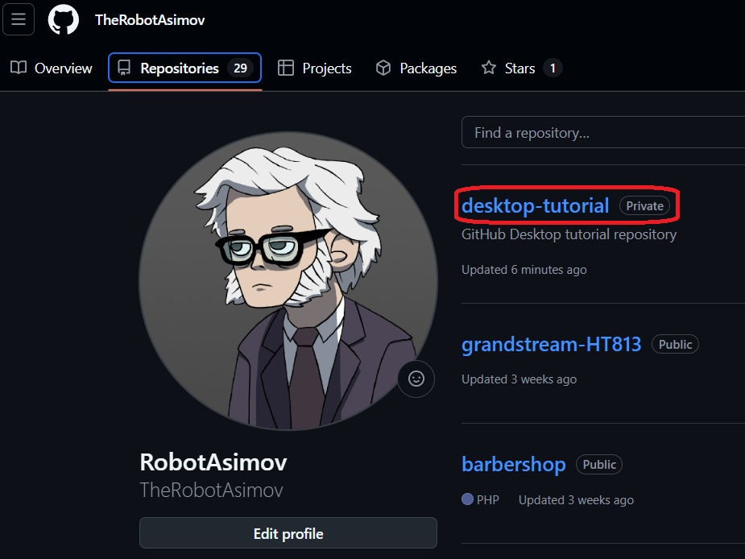

*
(Simón, soy ese blanco albino)
*

>Verán que del lado derecho dice `Private`. Eso significa que solo ustedes pueden verlo 🕵️‍♂️. Si quieren que todos lo vean, debería decir `Public` 🌐.

### Crear ramas (o branches en inglés)

Recuerdan que les dije que pueden tener diferentes universos paralelos de su proyecto, bueno en ***Git*** cada universo se conoce como rama (branch). La rama principal se suele llamar *main* o *master*.
El *modus operandi* es que cada vez que quieran hacer un cambio en su proyecto, creen una rama nueva.

Si todo sale bien, pueden fusionar su rama con la rama principal. Si no, pueden borrar esa rama y seguir trabajando en la rama principal. El chiste es proteger la main branch de cambios que puedan romper el proyecto 🛡️.

Eso es lo que nos pide el tutorial, que creemos una rama nueva. Entonces la creamos (damos clic en *New branch*):

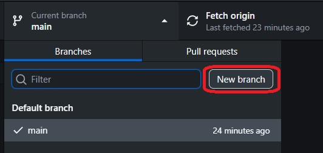

Le damos un nombre y le damos en Create branch

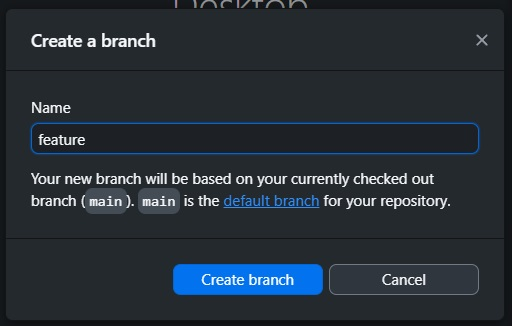

### Hacer cambios

Ahora nos pedira que hagamos cambios en nuestro proyecto.

>Cuando creamos el repositorio de tutorial, también nos creó el archivo `README.md` (Este archivo suele ser usado para explicar de que trata un repositorio y de hecho ahora mismo estas leyendo un archivo `README.md`).

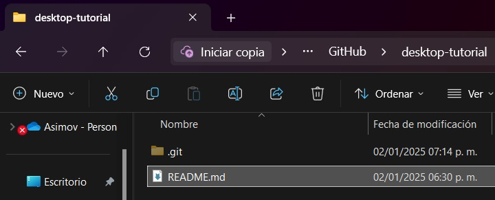

Entonces abrimos el archivo `README.md`. Damos clic en Open editor para abrir el archivo.

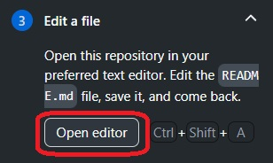

Este es el contenido del archivo:

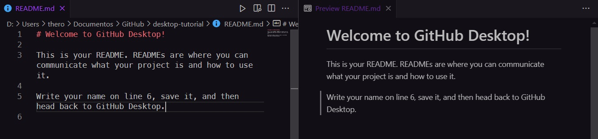

El lado izquierdo es el archivo original y el lado derecho es como se visualizará en **GitHub**

>Los archivos `.md` *(o markdown)* son archivos especiales para hacer anotaciones.

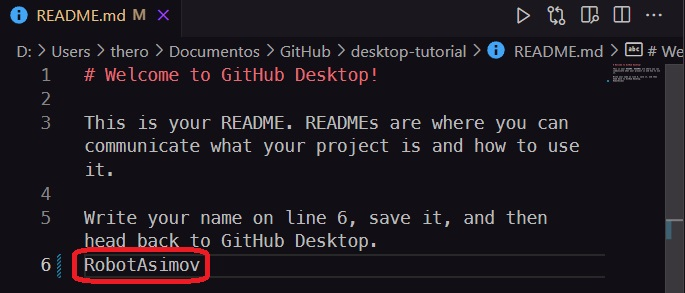

Modificamos el archivo. Podemos escribir algo adicional o borrar algo de lo que ya estaba. En mi caso, agregué mi *username* en la línea 6.

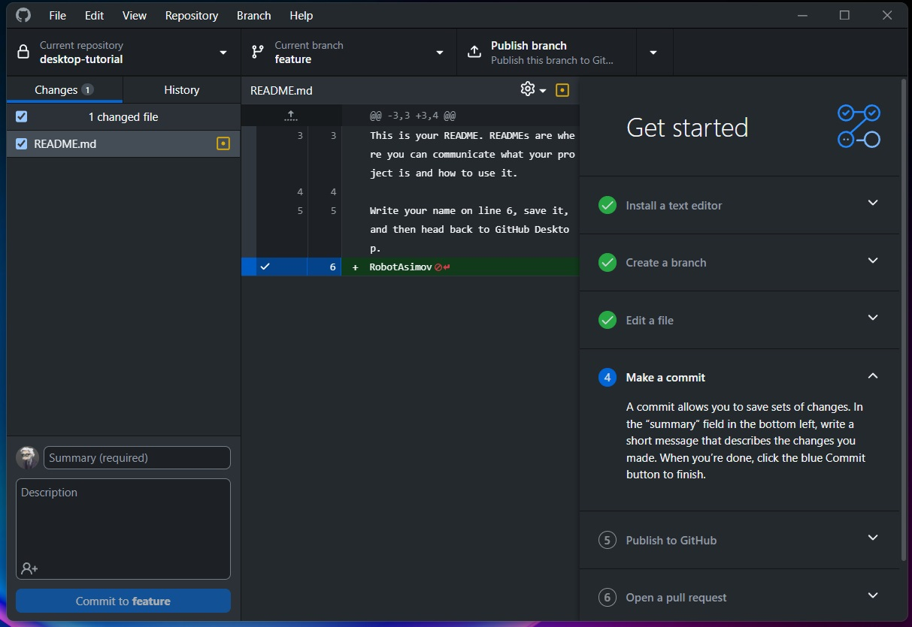

***GitHub Desktop*** es muy perspicaz y detecta que hicimos cambios en el archivo. Ahora haremos lo que se denomina *commit*, o sea guardar los cambios para que se quede registrado en el historial.

### Guardar cambios (commit)

Cada vez que hagan un *commit* es obligatorio agregar una descripción de los cambios que hicieron. En este caso, puse *"Agregué mi username en `README.md`"*. 

Le dan en Commit to **<nombre de su rama\>**.

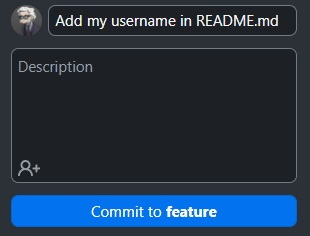

### Subir cambios a GitHub (push)

Excelente, ya agregaron una nueva versión de su proyecto de manera local. Ahora toca subir esos cambios a ***GitHub***. A eso se le llama *push*.

Para esto denle clic en Publish branch.

### Fusionar ramas (*pull request* y *merge*)

>Ya subieron su cambio a ***GitHub***, pero recuerden que crearon una rama y los cambios aún no están en la rama principal.

Para fusionar las dos ramas, deben hacer un pull request o solicitud de fusión.

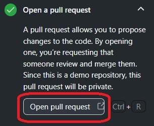

Les abrirá la siguiente ventana:

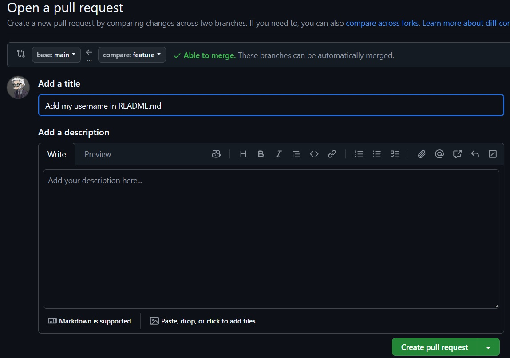

Aquí es donde se suele discutir los cambios que se hicieron 🔍 (muy esquizo ahorita porque estan solitos en este proyecto). Se pueden hacer varias cosas aquí pero por ahora solo le dan en **Create pull request**.

>***GitHub*** analiza los cambios que hicieron y, si todo está bien, les da la opción de fusionar (merge) los cambios a la rama principal.

Le dan en **Merge pull request**.

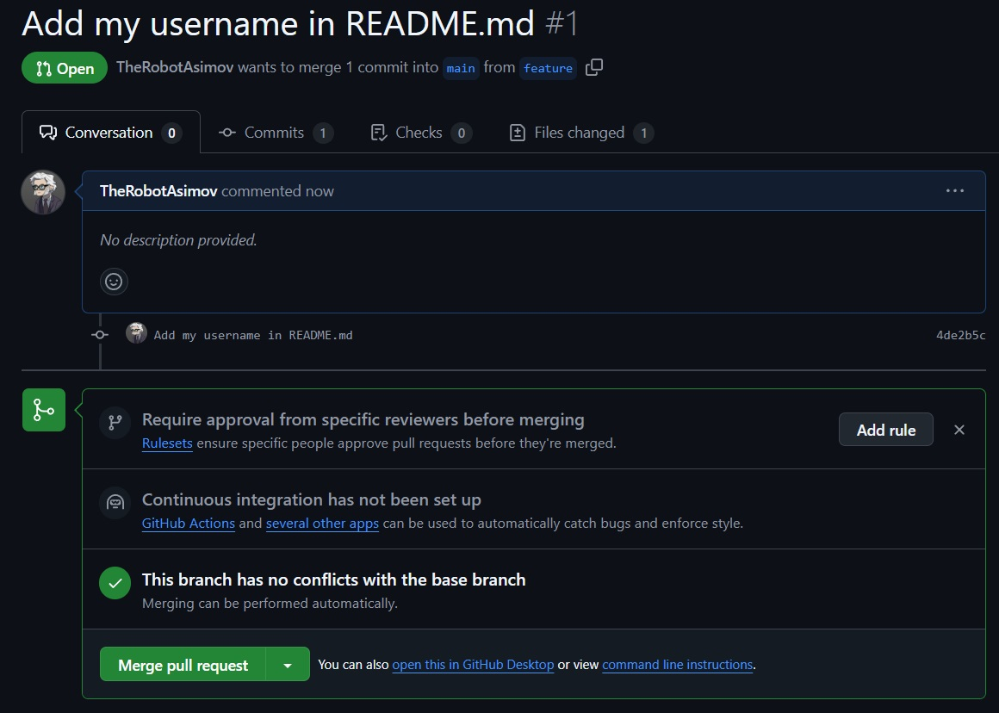

Confirmamos el merge

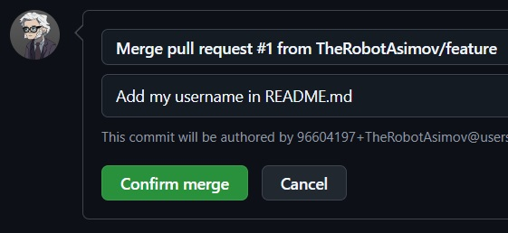

Y listo 🙌. Ahora nos da la opción de borrar la rama que creamos, pero ya no me importa que hagan aquí, ya hicieron todo lo que tenían que hacer. (Le dan en *"Delete branch"*)

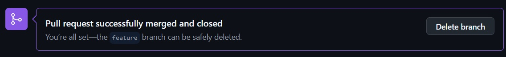

Si le dan en *"desktop-tutorial"* o en *"Code"* les llevará a la página principal de su repositorio en ***GitHub***.

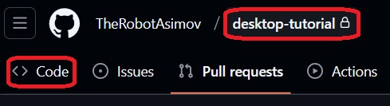

Verán que se guardó el *commit* que hicieron.

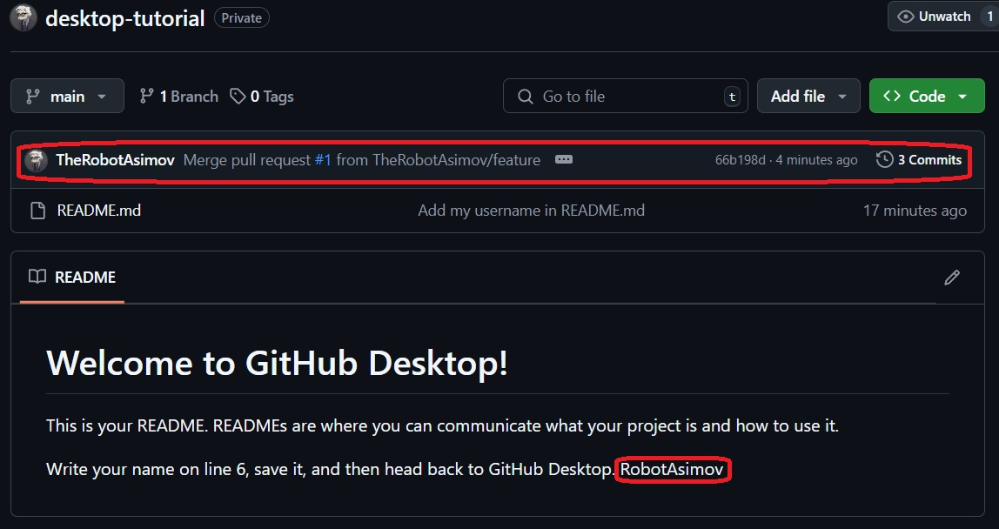

## 3. Fin

Aún hay más cosas que decir sobre todo esto que vimos y mucho más sobre lo que no hemos visto.
Pero por lo menos ya han dado sus primeros pasos en este mundo de ***GitHub*** 👣 y ahora están un paso más cerca de ser un desarrollador profesional 👏.

Pueden buscar tutoriales más avanzados en internet 👨‍💻 o seguir experimentando con ***GitHub Desktop***. También pueden intentar usar ***Git*** desde la terminal, que es la forma más pura de usar ***Git***.

>Incluso si veo interés podríamos hacer un repositorio entre todos para que practiquen más.
